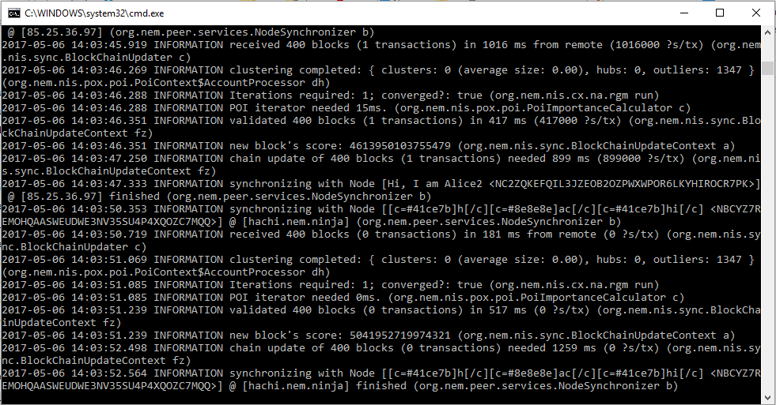
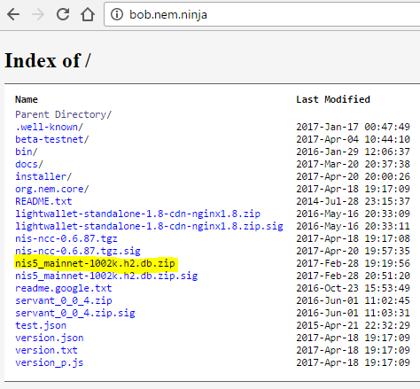
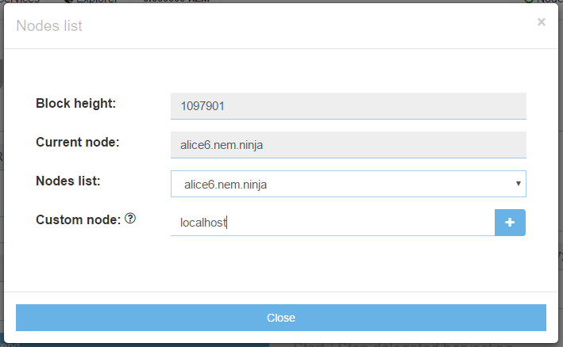

## Local NIS
Above we showed how to harvest on a remote node, and it is a normal case for many that they run delegated harvesting on a remote NIS, but it is also possible to run delegated harvesting on a local NIS. The advantage of this is that you will always know that your account is being harvested on and you won't have to rely on others. 

**NIS needs Java 8 64 bit to run. Download it from [java.com](https://www.java.com/en/download/manual.jsp) and install it with default values.**

To run a local node, download and extract the standalone client from [nem.io](https://www.nem.io/install.html) or [the developer's repository](http://bob.nem.ninja/). 

In the extracted folder (nis-ncc) you will find a file called "runNis" (Windows: runNis.bat, OSX/Linux: nix.runNis.sh).

* Windows: Execute the file by double-clicking it.
* OSX/Linux: Open a terminal, navigate to the folder "nis-ncc" and execute "nix.runNis.sh"

Once NIS runs, let it run for 1-2 minutes and stop it. We do this to let NIS create the needed folder structure.
Navigate to the created folder structure.
* Windows: C:\users\username\nem\nis\data
* OSX/Linux: username/nem/nis/data

Delete both files (NIS needs to be stopped to delete the files).
Navigate to [bob.nem.ninja](http://bob.nem.ninja) and download the DB file. We do this to speed up the initial sync of NIS.

After the download completes, extract the file "nis5_mainnet.h2.db" and place it in the folder from above.

Once you have done this, start NIS again with "runNis" and let it run in the background. NIS will now finish syncing. 

To check if it is synced, you can open [alice6.nem.ninja:7890/chain/height](http://alice6.nem.ninja:7890/chain/height) in a web browser.

Open [localhost:7890/chain/height](http://localhost:7890/chain/height) in another web browser window to compare the block height to alice6 (localhost needs to be **at least** at the same block height as alice6).

When NIS is synced click on the "Node" option in the top bar of your NanoWallet and enter "localhost" in the "Custom node" field:

Click "+" to select localhost. It should look like this:

After that close the node settings. 
You are now connected to your local NIS!

**Remember to let NIS run in the background!
To start delegated harvesting with your local NIS repeat the steps from above but select "localhost" in the "Start/Stop delegated harvesting" panel for your node.**
