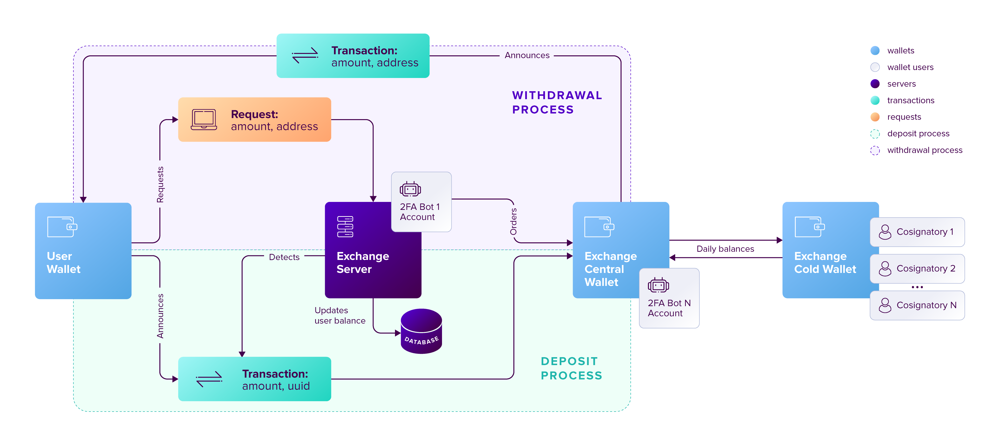
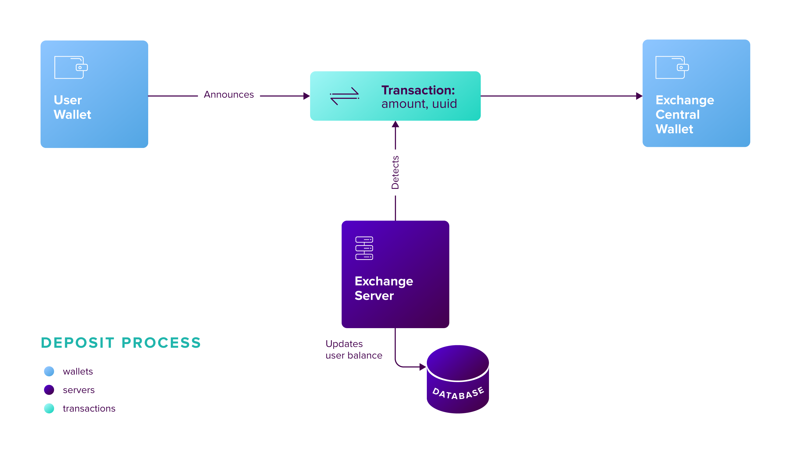
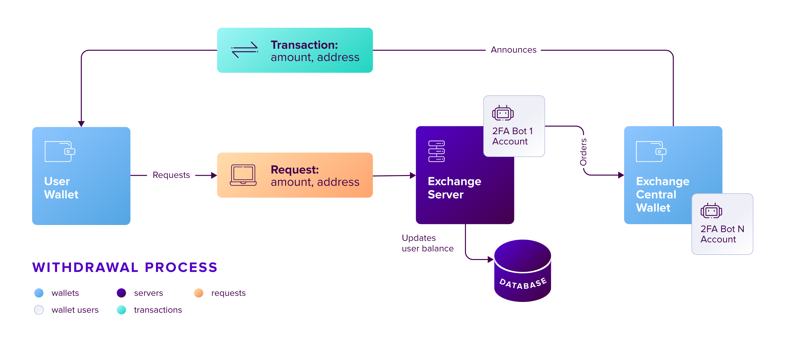

- TOC
{:toc}

This document is intended to **guide developers** through the integration of the ``XEM`` token into an **Exchange platform**. It contains recommendations on how to set up accounts, listen for deposits, and create withdrawals as well as links to the REST API endpoints that should be used.

## Integration overview

There are many ways to design an exchange. This guide is based on how to support ``XEM`` deposits and withdrawals in an exchange that follows a **central wallet approach**.

Please note that this design is not particularly recommend over others. However, its **simplified architecture** is a good showcase for NEM's set of features involved in integrating with an Exchange. A different approach, for example, would be to use a different wallet for each user.

**Fig. 1**: General design diagram of the central wallet approach. [_Click to enlarge._](exchange-integration-overview.png){:target="_blank"}
{:.caption}

The main components of this architecture are described next.

### Components

#### Central wallet
{:.no_toc}

The exchange owns a NEM account where all the user's deposits and withdrawals occur. The keys to this account need to be on an online machine, so this is also commonly called the **Hot** wallet. This account only has the necessary amount of ``XEM`` for daily use (withdrawals and deposits), since it is the account most exposed to attacks.

#### Cold wallet
{:.no_toc}

Cold wallet(s) hold a certain threshold for the pool of ``XEM``. These accounts should be created and remain in a setup with no internet connection. Transactions issued from cold wallets must be signed offline and announced to the network using another device. It is advisable as well that cold wallets are set up with [Multi-signature](../../Concepts/address-components/docs.en.md#multisig-accounts).

#### Unique User ID
{:.no_toc}

In the proposed architecture, each user is identified by a Unique User IDentifier (UUID) on the exchange's database. A user will deposit to the central wallet with their UUID attached as the [message](../../Guides/nanowallet/send-receive/docs.en.md#sending-xem-to-exchanges) of the transaction (called sometimes the **memo**). The UUID is only shown in the user's dashboard during the deposit confirmation.

One of the drawbacks of this design is that many users are not used to having a message attached to their transactions. If they forget to attach the UUID or attach a wrong UUID, it will lead to receiving lots of support tickets concerning "lost funds".

#### Exchange Server
{:.no_toc}

This machine is constantly listening for user's withdraw requests, and monitors the blockchain to detect user deposits into the Exchange Central Wallet. As explained in the rest of this document, it maintains the database updated and announces any required transaction.

#### Exchange Database
{:.no_toc}

All the user's funds are merged together in the Exchange's wallets. This database keeps track of the amount of tokens each individual user holds. It also records all processed transactions, for record-keeping and to avoid processing the same transaction more than once.

### Running a node

Although not absolutely necessary, it is **recommended** that Exchanges deploy **their own NEM node** to communicate with the rest of the network. Since each node automatically connects to **several other nodes** on the network, this approach is more robust than accessing the network always through the same public node, which **might become unavailable**.

Also, by running your own, secure node, you can use the simplified REST API which takes care of signing transactions for you [as explained below](#announcing-the-transaction).

See the [tutorials](../../Community/tutorials/docs.en.md) section to learn how to deploy a node.

### Accounts setup

Exchanges can create the central and cold wallets by [downloading the NanoWallet](../../Guides/nanowallet/docs.en.md).

Every wallet has assigned an [account](../../Concepts/address-components/docs.en.md) (a deposit box that holds tokens, which can only be transferred with the appropriate private key).



It is advisable to turn central and cold wallets into [multi-signature accounts](../../Concepts/address-components/docs.en.md#multisig-accounts) to add **two-factor authentication**. The cosignatories of the multisig account become the account managers, so no transaction can be announced from the multisig account without the cosignatories' approval. NEM's current implementation of multisig is **“M-of-N”** meaning that *M* out of the total *N* cosignatories of an account need to approve a transaction for it to be announced.



### The XEM token

The native currency of the NEM network is named ``XEM``. The token is used to pay for transactions and service fees, which are used as well to provide an incentive for those participants who secure the network and run the infrastructure.

Tokens can be divided up to ``divisibility`` decimal places. Amounts given without decimals are called **absolute**, whereas when decimals are used amounts are called **relative**. For example, when divisibility is 6, 1 relative token corresponds to 1'000'000 absolute tokens, and the smallest token is 0.000001 relative units. The smallest absolute unit is always 1, regardless of the divisibility.

These are the properties of ``XEM``:

| Property       | Value                    | Description                                                                |
| -------------- | ------------------------ | -------------------------------------------------------------------------- |
| ID             | ``nem:xem``              | Friendly name for the token                                                |
| Initial supply | 7'842'928'625 (relative) | Initial amount of token units in circulation                               |
| Max supply     | 8'999'999'999 (relative) | Maximum amount of token units in circulation after inflation is applied    |
| Divisibility   | 6                        | This means that the smallest fraction of the token is 0.000001 (relative). |
| Duration       | 0                        | Token does not expire                                                      |
| Supply mutable | False                    | Token supply cannot be altered                                             |
| Transferable   | True                     | Token can be transferred between arbitrary accounts                        |
| Restrictable   | False                    | Token creator cannot restrict which accounts can transact with the mosaic  |

### Avoiding rollbacks

This is a **classic conflict** in blockchain technology: On one hand, if transactions are accepted too quickly, they might need to be **reverted** later on in the event of a network fork. On the other hand, waiting for too long is **inconvenient** for users.

The standard procedure in most blockchains is to **wait for a few blocks** to be validated (added to the blockchain) before accepting a transaction.

The amount of blocks to wait for depends on the risk one wants to accept. The recommendation for NEM is **20 blocks** (about 10 minutes).

#### Deadlines
{:.no_toc}

An added problem caused by rollbacks is that **transactions might expire** in the process of resolving a network fork.

A bit of context is required here. Transactions are not allowed to remain unconfirmed in the network forever, as this would pose a significant strain on the network's resources. Instead, **all transactions have a deadline**, and are automatically disposed of when the deadline arrives.

Users are free to use any deadline they want for their transactions within a 24h window after the transaction is submitted.

Transactions which are about to expire are delicate because, even if they get confirmed and are added to the blockchain, **a rollback could send them back to the unconfirmed state** and their deadline could expire before they are confirmed again.

**Therefore, it is recommended that:**

- Incoming transactions with a deadline **less than 1h into the future** are rejected with a warning message, for example:

  ``Transaction is too close to expiration to be safely accepted.``

- Exchanges avoid using transactions with short lifespans.

- Exchanges actively encourage their customers to avoid using transactions with short lifespans.

## Monitoring deposits

**Fig. 2**: Deposit process. [_Click to enlarge._](exchange-integration-deposit.png){:target="_blank"}
{:.caption}

Users perform deposits by announcing a regular transfer transaction using their wallet, moving the funds from their account directly to the Exchange Central Wallet. Since the transfer is handled entirely by the blockchain, the funds will be added to the Exchange Central Wallet without the Exchange's mediation, and this poses some problems:

- The **intended recipient** of the transaction must be determined. This is done by attaching the user's UUID as the transaction's message.
- The fact that a transaction has happened must be timely detected to update the user's account on the Exchange.
- A number of block confirmations needs to be waited to minimize the risk of **rollbacks**.

The mechanism proposed below addresses all these issues by **monitoring incoming transactions**: The blockchain is polled periodically and all relevant transactions since the last poll are processed in a batch:

1. **Check for all transactions destined to the Central Exchange Wallet** added to the blockchain **since** the last checked block and **up to** 20 blocks below the current chain height.

   Transactions younger than 20 blocks should be ignored since they haven't had enough confirmations and are therefore susceptible to [rollbacks](#avoiding-rollbacks).

   > - [`/account/transfers/incoming`](https://nemproject.github.io#requesting-transaction-data-for-an-account): Retrieves the last 25 transactions sent to the account. Examine each transaction's ``meta.height`` field and manually filter out the ones outside the block range of interest.
   >
   >   It might happen that more than 25 transactions have been sent since the last poll.
   >   Make sure you examine them all by requesting new batches if the oldest transaction the endpoint returns happened **after** the last poll.
   >   Use the ``hash`` or ``id`` parameters for this.
   {:.endpoint}

2. **Ignore transactions that**:

   1. Have no message or the message does not correspond to an existing UUID.

      Check the ``transaction.message`` field.

   2. Do not contain tokens, or the token is not ``nem:xem``.

      [Version 1 transfer transactions](https://nemproject.github.io/#version-1-transfer-transactions) always transfer ``XEM`` tokens. Check the ``amount`` field.

      [Version 2 transfer transactions](https://nemproject.github.io/#version-2-transfer-transactions) can transfer any kind of mosaic besides ``XEM`` tokens. Check the ``amount`` field but also the ``mosaicId`` and ``quantity``.

   3. Have already been processed (as a security measure).

      Check that the ``meta.hash`` field is not already present in the Exchange's database of processed transactions.

3. **Process the remaining transactions**:

   1. Add the tokens to the user's account in the Exchange's database.

   2. Mark the transaction as "processed" by adding its ``meta.hash`` to the database.

4. **Store the last processed block height** and wait for the next polling period.

   Blocks in the NEM blockchain are generated roughly every 30 seconds so this is a good candidate for the polling period.

## Performing withdrawals

**Fig. 3**: Withdrawal process. [_Click to enlarge._](exchange-integration-withdrawal.png){:target="_blank"}
{:.caption}

Users send withdrawal requests to the Exchange Server, via a web page or mobile app, for example. If the database indicates that the user has enough funds to perform the withdrawal, a [transfer transaction](https://nemproject.github.io/#initiating-a-transfer-transaction) is announced from the Exchange Central Wallet to the NEM address indicated in the request.

Announcing the transaction has a [fee](https://nemproject.github.io/#transaction-fees) which is paid by the Exchange Central Wallet but can be deduced from the user's account. Regardless of the token being transferred, fees are always paid in ``XEM`` tokens.

The withdrawal process requires two steps: First the transaction transferring the funds is **announced** and confirmed (added to the blockchain). Afterwards, the exchange needs to wait for 20 more blocks to be confirmed to [reduce the risk of rollbacks](#avoiding-rollbacks).

### Announcing the transaction

The withdrawal transaction is just a regular [transfer transaction](https://nemproject.github.io/#initiating-a-transfer-transaction).

> - [`/transaction/prepare-announce`](https://nemproject.github.io/#initiating-a-transaction): This endpoint signs the transaction for you so it needs the Central Wallet's private key. **Caution**: Use only when connecting to [your own node](#running-a-node).
>
> - [`/transaction/announce`](https://nemproject.github.io/#creating-a-signed-transaction): This endpoint is more secure but it requires you to sign the transaction before submitting.
{:.endpoint}

{% include topic.html title="Multi-signature accounts" content="When the Exchange Central Wallet is a [multi-signature account](../../Concepts/address-components/docs.en.md#multisig-accounts) announcing the transaction is slightly more complex, as it involves the central wallet and its cosignatories. Make sure you understand [how to create multisig transactions](https://nemproject.github.io/#multisigTransaction) and [how to announce multisig transactions](https://nemproject.github.io/#initiating-a-multisig-transaction)." %}

Once the transaction is confirmed, the next step is to wait for a few blocks. Until then, the transaction should be marked as **pending** and **not acted upon**.

### Waiting for confirmations

Waiting for the transaction to be secure is performed in a manner very similar to how incoming deposits are monitored (see [Monitoring deposits](#monitoring-deposits) above): The blockchain is polled periodically and all transactions since the last check are processed in a batch, looking for outgoing transfers which happened enough blocks ago.

This process can obviously be performed in the same loop that monitors for incoming deposits.
